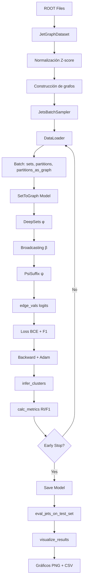

# Resumen Técnico: Implementación S2G-GNN para b-tagging

## 1. Arquitectura del Proyecto

### 1.1 Estructura de Directorios
```
S2G-GNN-for-b-tagging-in-LHC/
├── data/                    # Datasets en formato ROOT
├── dataloaders/             # Carga y preprocesamiento
├── models/                  # Arquitecturas neuronales
├── main_scripts/            # Scripts de entrenamiento/evaluación
├── performance_eval/        # Métricas y visualización
└── experiments/             # Resultados guardados
```

---

## 2. Pipeline de Datos

### 2.1 Formato de Entrada: ROOT Files

**Fuente**: Archivos `.root` (formato HEP) generados por PYTHIA8 + DELPHES
- `training_data.root` (500k jets)
- `valid_data.root` (100k jets)  
- `test_data.root` (100k jets)

**Estructura interna** (TTree con ramas):
```python
# Variables por traza (arrays variables)
'trk_d0'         # Impact parameter transversal
'trk_z0'         # Impact parameter longitudinal
'trk_phi'        # Ángulo azimutal
'trk_ctgtheta'   # Cotangente ángulo polar
'trk_pt'         # Momento transversal
'trk_charge'     # Carga eléctrica
'trk_vtx_index'  # Índice de vértice (ground truth)

# Variables por jet (valores escalares)
'jet_pt'         # Momento transversal del jet
'jet_eta'        # Pseudorapidez
'jet_phi'        # Ángulo azimutal
'jet_M'          # Masa invariante
'jet_flav'       # Sabor: 5=b, 4=c, 0=light
```

### 2.2 Clase JetGraphDataset

**Ubicación**: `dataloaders/jets_loader.py`

**Responsabilidades**:
1. Lectura de archivos ROOT con `uproot3`
2. Normalización de features
3. Construcción de representaciones de grafos
4. Gestión de batches por número de trazas

#### Inicialización
```python
class JetGraphDataset(Dataset):
    def __init__(self, which_set, debug_load=False, add_jet_flav=False, add_rave_file=False):
```

**Parámetros**:
- `which_set`: 'train', 'validation', 'test'
- `debug_load`: Si True, carga solo 100 jets (debug rápido)
- `add_jet_flav`: Incluye etiquetas de sabor (b/c/light)
- `add_rave_file`: Carga predicciones de algoritmo RAVE (baseline)

**Proceso de carga**:
```python
# 1. Abrir archivo ROOT
with uproot.open(filename) as f:
    tree = f['tree']
    
    # 2. Leer número de jets y trazas por jet
    self.n_jets = int(tree.numentries)
    self.n_nodes = np.array([len(x) for x in tree.array(b'trk_vtx_index')])
    
    # 3. Cargar todas las ramas en memoria
    self.jet_arrays = tree.arrays(jet_features_list + node_features_list + ['trk_vtx_index'])
```

#### Normalización de Features

**Clase**: `FeatureTransform` (hardcoded con estadísticas del train set)

```python
# Media y std calculadas del conjunto de entrenamiento
node_feature_transform_list = [
    (0.0006078152, 14.128961),   # trk_d0
    (0.0038490593, 10.688491),   # trk_z0
    (-0.0026713554, 1.8167108),  # trk_phi
    (0.0047640945, 1.889725),    # trk_ctgtheta
    (5.237357, 7.4841413),       # trk_pt
    (-0.00015662189, 1.0)        # trk_charge
]

def transform_features(transform_list, arr):
    """Z-score normalization: (x - μ) / σ"""
    new_arr = np.zeros_like(arr)
    for col_i, (mean, std) in enumerate(transform_list):
        new_arr[col_i, :] = (arr[col_i, :] - mean) / std
    return new_arr
```

#### Construcción de Items (get_all_items)

**Entrada**: Arrays raw del ROOT file  
**Salida**: Tuplas `(set_i, partition_i, partition_as_graph_i)`

**Proceso por jet**:
```python
for i in range(self.n_jets):
    n_nodes = self.n_nodes[i]  # Número de trazas en jet i
    
    # 1. Extraer features de trazas (6 dim) y jet (4 dim)
    node_feats_i = np.stack(node_feats[:, i], axis=0)  # shape (6, n_nodes)
    jet_feats_i = jet_feats[:, i]                      # shape (4,)
    
    # 2. Normalizar
    node_feats_i = transform_features(..., node_feats_i)
    jet_feats_i = transform_features(..., jet_feats_i)
    
    # 3. Broadcast jet features a todas las trazas
    jet_feats_i = np.repeat(jet_feats_i[:, np.newaxis], n_nodes, axis=1)  # shape (4, n_nodes)
    
    # 4. Concatenar: cada traza tiene 10 features (6 propias + 4 del jet)
    set_i = np.concatenate([node_feats_i, jet_feats_i]).T  # shape (n_nodes, 10)
    
    # 5. Ordenar por pt (importante para reproducibilidad)
    sort_order = np.argsort(node_feats_i[4])  # índice 4 = trk_pt
    set_i = set_i[sort_order]
    
    # 6. Construir matriz de adyacencia ground truth
    partition_i = n_labels[i]  # Array con índice de vértice por traza
    tile = np.tile(partition_i, (n_nodes, 1))
    partition_as_graph_i = np.where((tile - tile.T), 0, 1)  # 1 si mismo vértice, 0 sino
    
    yield set_i, partition_i, partition_as_graph_i
```

**Tipos de datos resultantes**:
```python
set_i                # np.ndarray, shape (n_tracks, 10), dtype float32
partition_i          # np.ndarray, shape (n_tracks,), dtype int
partition_as_graph_i # np.ndarray, shape (n_tracks, n_tracks), dtype int
                     # Matriz simétrica: [i,j]=1 si traza i,j mismo vértice
```

### 2.3 Batch Sampling: JetsBatchSampler

**Problema**: Jets tienen número variable de trazas (2 a ~50)  
**Solución**: Agrupar jets con mismo número de trazas en cada batch

```python
class JetsBatchSampler(Sampler):
    def __init__(self, n_nodes_array, batch_size):
        # Agrupar índices por número de trazas
        for n_nodes_i in set(n_nodes_array):
            self.node_size_idx[n_nodes_i] = np.where(n_nodes_array == n_nodes_i)[0]
            
            # Dividir en batches
            n_batches = max(len(indices) / batch_size, 1)
            self.node_size_idx[n_nodes_i] = np.array_split(
                np.random.permutation(indices), n_batches
            )
```

**Ventaja**: Todos los jets en un batch tienen la misma forma → procesamiento eficiente sin padding.

### 2.4 DataLoader

```python
def get_data_loader(which_set, batch_size, debug_load=False, ...):
    jets_data = JetGraphDataset(which_set, debug_load, ...)
    batch_sampler = JetsBatchSampler(jets_data.n_nodes, batch_size)
    data_loader = DataLoader(jets_data, batch_sampler=batch_sampler)
    return data_loader
```

**Output del DataLoader**:
```python
for sets, partitions, partitions_as_graph in data_loader:
    # sets: torch.Tensor, shape (B, N, 10)
    # partitions: torch.Tensor, shape (B, N), dtype long
    # partitions_as_graph: torch.Tensor, shape (B, N, N), dtype float
    # donde B = batch_size, N = número de trazas (fijo en batch)
```

---

## 3. Arquitectura del Modelo S2G

### 3.1 Clase SetToGraph

**Ubicación**: `models/set_to_graph.py`

**Parámetros de inicialización**:
```python
SetToGraph(
    in_features=10,           # Dimensión de entrada (6 track + 4 jet)
    out_features=1,           # Salida: score por arista
    set_fn_feats=[256,256,256,256,5],  # Arquitectura DeepSets
    method='lin5',            # 'lin2' o 'lin5'
    hidden_mlp=[256],         # MLP intermedio
    predict_diagonal=False,   # No predecir diagonal
    attention=True,           # Usar atención
    set_model_type='deepset'  # Tipo de modelo set-to-set
)
```

#### Forward Pass

```python
def forward(self, x):
    # Input: x.shape = (B, N, 10)
    
    # 1. Transponer para DeepSet
    x = x.transpose(2, 1)  # (B, 10, N)
    
    # 2. Set-to-Set: φ(x)
    u = self.set_model(x)  # (B, 5, N) - representación oculta de cada traza
    n = u.shape[2]
    
    # 3. Broadcasting: β(u)
    if self.method == 'lin2':
        m1 = u.unsqueeze(2).repeat(1, 1, n, 1)  # (B, 5, N, N) - broadcast rows
        m2 = u.unsqueeze(3).repeat(1, 1, 1, n)  # (B, 5, N, N) - broadcast cols
        block = torch.cat((m1, m2), dim=1)      # (B, 10, N, N)
    
    elif self.method == 'lin5':
        m1 = u.unsqueeze(2).repeat(1, 1, n, 1)  # (B, 5, N, N)
        m2 = u.unsqueeze(3).repeat(1, 1, 1, n)  # (B, 5, N, N)
        m3 = self.agg(u, dim=2, keepdim=True).unsqueeze(3).repeat(1, 1, n, n)  # (B, 5, N, N) - global
        m4 = u.diag_embed(dim1=2, dim2=3)      # (B, 5, N, N) - diagonal
        m5 = self.agg(u, dim=2, keepdim=True).repeat(1, 1, n).diag_embed(dim1=2, dim2=3)  # (B, 5, N, N)
        block = torch.cat((m1, m2, m3, m4, m5), dim=1)  # (B, 25, N, N)
    
    # 4. Edge Classifier: ψ(block)
    edge_vals = self.suffix(block)  # (B, 1, N, N)
    
    return edge_vals
```

**Flujo de dimensiones (lin5, N=10 trazas)**:
```
(B, 10, 10)  →  DeepSets  →  (B, 5, 10)  →  Broadcasting  →  (B, 25, 10, 10)  →  MLP  →  (B, 1, 10, 10)
```

### 3.2 Componente φ: DeepSets

**Ubicación**: `models/deep_sets.py`

**Arquitectura**:
```python
class DeepSet(nn.Module):
    def __init__(self, in_features, feats, attention, cfg):
        layers = []
        layers.append(DeepSetLayer(in_features, feats[0], attention, ...))
        for i in range(1, len(feats)):
            layers.append(nn.ReLU())
            layers.append(DeepSetLayer(feats[i-1], feats[i], attention, ...))
        self.sequential = nn.Sequential(*layers)
```

**DeepSetLayer**:
```python
class DeepSetLayer(nn.Module):
    def __init__(self, in_features, out_features, attention, normalization, second_bias):
        self.attention = Attention(in_features) if attention else None
        self.layer1 = nn.Conv1d(in_features, out_features, 1)
        self.layer2 = nn.Conv1d(in_features, out_features, 1, bias=second_bias)
    
    def forward(self, x):
        # x.shape = (B, C, N)
        if self.attention:
            x_T = x.transpose(2, 1)  # (B, N, C)
            attended = self.attention(x_T).transpose(1, 2)  # (B, C, N)
            x = self.layer1(x) + self.layer2(attended)
        else:
            x = self.layer1(x) + self.layer2(x - x.mean(dim=2, keepdim=True))
        
        # Normalización Frobenius
        x = x / torch.norm(x, p='fro', dim=1, keepdim=True)
        return x
```

**Mecanismo de Atención**:
```python
class Attention(nn.Module):
    def forward(self, inp):
        # inp.shape = (B, N, C)
        q = self.query(inp)  # (B, N, C/10) - queries
        k = self.key(inp)    # (B, N, C/10) - keys
        
        # Scaled dot-product attention
        scores = torch.matmul(q, k.transpose(1, 2)) / sqrt(self.d_k)  # (B, N, N)
        attention_weights = scores.transpose(1, 2).softmax(dim=2)     # (B, N, N)
        
        output = torch.matmul(attention_weights, inp)  # (B, N, C)
        return output
```

**Interpretación**: Cada traza "atiende" a las demás, ponderando su influencia según similitud en espacio reducido.

### 3.3 Componente ψ: PsiSuffix (Edge Classifier)

**Ubicación**: `models/layers.py`

```python
class PsiSuffix(nn.Module):
    def __init__(self, features, predict_diagonal):
        # features = [d_edge, 256, 1] para S2G
        layers = []
        for i in range(len(features) - 2):
            layers.append(DiagOffdiagMLP(features[i], features[i+1], predict_diagonal))
            layers.append(nn.ReLU())
        layers.append(DiagOffdiagMLP(features[-2], features[-1], predict_diagonal))
        self.model = nn.Sequential(*layers)
```

**DiagOffdiagMLP**:
```python
class DiagOffdiagMLP(nn.Module):
    def __init__(self, in_features, out_features, separate_diag):
        self.conv_offdiag = nn.Conv2d(in_features, out_features, 1)
        if separate_diag:
            self.conv_diag = nn.Conv1d(in_features, out_features, 1)
    
    def forward(self, x):
        # x.shape = (B, C, N, N)
        if self.separate_diag:
            diag_features = x.diagonal(dim1=2, dim2=3)  # (B, C, N)
            diag_out = self.conv_diag(diag_features).diag_embed(dim1=2, dim2=3)
            return self.conv_offdiag(x) + diag_out
        return self.conv_offdiag(x)
```

**Uso de Conv2d**: Procesa matriz (N×N) como imagen de 1 canal, aplicando transformación lineal a cada entrada.

---

## 4. Loop de Entrenamiento

### 4.1 Script Principal: main_jets.py

**Inicialización del modelo**:
```python
model = SetToGraph(10, out_features=1, set_fn_feats=[256,256,256,256,5],
                   method='lin5', hidden_mlp=[256], predict_diagonal=False,
                   attention=True, set_model_type='deepset')
model = model.to(DEVICE)  # DEVICE = 'cpu'

optimizer = torch.optim.Adam(model.parameters(), lr=0.001)
```

**Número de parámetros**: 461,289 (para lin5)

### 4.2 Función de Pérdida

```python
def get_loss(y_hat, y):
    """
    y_hat: Logits predichos, shape (B, N, N)
    y: Ground truth, shape (B, N, N), dtype float
    """
    y = y.float()
    B, N, _ = y_hat.shape
    
    # 1. Enmascarar diagonal (auto-conexiones triviales)
    y_hat[:, torch.arange(N), torch.arange(N)] = torch.finfo(y_hat.dtype).max
    
    # 2. Binary cross-entropy
    loss_bce = F.binary_cross_entropy_with_logits(y_hat, y)
    
    # 3. Penalización por F1-score (opcional, mejora convergencia)
    y_hat_prob = torch.sigmoid(y_hat)
    tp = (y_hat_prob * y).sum(dim=(1, 2))
    fn = ((1 - y_hat_prob) * y).sum(dim=(1, 2))
    fp = (y_hat_prob * (1 - y)).sum(dim=(1, 2))
    f1_loss = ((2 * tp) / (2 * tp + fp + fn + 1e-10)).sum()
    
    return loss_bce - f1_loss
```

**Nota**: Enmascarar diagonal con `max` evita que contribuya al gradiente.

### 4.3 Inferencia de Clusters

```python
def infer_clusters(edge_vals):
    """
    edge_vals: Logits, shape (B, N, N)
    Returns: Cluster assignment, shape (B, N), dtype long
    """
    b, n, _ = edge_vals.shape
    
    # 1. Simetrizar scores
    pred_matrices = edge_vals + edge_vals.transpose(1, 2)
    
    # 2. Umbralizar (>= 0 porque ya son simetrizados)
    pred_matrices = pred_matrices.ge(0.).float()
    
    # 3. Forzar diagonal = 1
    pred_matrices[:, torch.arange(n), torch.arange(n)] = 1
    
    # 4. Clausura transitiva (multiplicación matricial iterativa)
    ones_now = pred_matrices.sum()
    while True:
        pred_matrices = torch.matmul(pred_matrices, pred_matrices)
        pred_matrices = pred_matrices.bool().float()
        ones_new = pred_matrices.sum()
        if ones_new == ones_now:
            break
        ones_now = ones_new
    
    # 5. Asignar cluster ID (primera traza conectada)
    clusters = -1 * torch.ones((b, n), device=edge_vals.device)
    for i in range(n):
        clusters = torch.where(pred_matrices[:, i] == 1, 
                               i * torch.ones(1, device=edge_vals.device), 
                               clusters)
    
    return clusters.long()
```

**Ejemplo** (N=5):
```
Scores:        Umbralizado:     Clausura:        Clusters:
  0.8 -0.1       1  0  0  0       1  1  0  0       0
  0.8  0.5       1  1  0  0       1  1  0  0       0
 -0.1  0.5       0  1  1  0  -->  0  1  1  1  -->  1
 -0.2 -0.3       0  0  1  1       0  1  1  1       1
 -0.1  0.1       0  0  1  1       0  1  1  1       1
```

### 4.4 Cálculo de Métricas

```python
def calc_metrics(pred_partitions, partitions_as_graph, partitions, accum_info):
    """
    pred_partitions: Clusters predichos, shape (B, N)
    partitions_as_graph: Ground truth matriz, shape (B, N, N)
    partitions: Ground truth labels, shape (B, N)
    accum_info: Dict acumulador
    """
    with torch.no_grad():
        B, N = partitions.shape
        C = pred_partitions.max().item() + 1
        
        # 1. Convertir predicciones a one-hot
        pred_onehot = torch.zeros((B, N, C), dtype=torch.float, device=partitions.device)
        pred_onehot.scatter_(2, pred_partitions[:, :, None], 1)
        
        # 2. Reconstruir matriz de predicciones
        pred_matrices = torch.matmul(pred_onehot, pred_onehot.transpose(1, 2))  # (B, N, N)
        
        # 3. Accuracy (pares correctos / total pares)
        equiv_pairs = (pred_matrices == partitions_as_graph).float()
        accum_info['accuracy'] += equiv_pairs.mean(dim=(1, 2)).sum().item()
        
        # 4. Rand Index (excluyendo diagonal)
        equiv_pairs[:, torch.arange(N), torch.arange(N)] = 0
        ri_batch = equiv_pairs.sum(dim=(1, 2)) / (N * (N - 1))
        accum_info['ri'] += ri_batch.sum().item()
        
        # 5. F-score, Precision, Recall (sklearn)
        for b in range(B):
            pred_labels = pred_partitions[b].cpu().numpy()
            true_labels = partitions[b].cpu().numpy()
            
            # Calcular pares TP, FP, FN
            tp, fp, fn = 0, 0, 0
            for i in range(N):
                for j in range(i+1, N):
                    pred_same = (pred_labels[i] == pred_labels[j])
                    true_same = (true_labels[i] == true_labels[j])
                    if pred_same and true_same:
                        tp += 1
                    elif pred_same and not true_same:
                        fp += 1
                    elif not pred_same and true_same:
                        fn += 1
            
            precision = tp / (tp + fp + 1e-10)
            recall = tp / (tp + fn + 1e-10)
            fscore = 2 * precision * recall / (precision + recall + 1e-10)
            
            accum_info['precision'] += precision
            accum_info['recall'] += recall
            accum_info['fscore'] += fscore
    
    return accum_info
```

### 4.5 Epoch Loop

```python
def do_epoch(data, model, optimizer=None):
    model.train() if optimizer else model.eval()
    accum_info = {k: 0.0 for k in ['ri', 'loss', 'accuracy', 'fscore', 'precision', 'recall', 'insts']}
    
    for sets, partitions, partitions_as_graph in data:
        sets = sets.to(DEVICE)
        partitions = partitions.to(DEVICE)
        partitions_as_graph = partitions_as_graph.to(DEVICE)
        batch_size = sets.shape[0]
        
        # Forward
        edge_vals = model(sets).squeeze(1)  # (B, 1, N, N) -> (B, N, N)
        
        # Loss
        loss = get_loss(edge_vals, partitions_as_graph)
        
        # Backward (solo si entrenamiento)
        if optimizer:
            optimizer.zero_grad()
            loss.backward()
            optimizer.step()
        
        # Métricas (inferencia sin gradientes)
        pred_partitions = infer_clusters(edge_vals)
        accum_info = calc_metrics(pred_partitions, partitions_as_graph, partitions, accum_info)
        accum_info['loss'] += loss.item() * batch_size
        accum_info['insts'] += batch_size
    
    # Promediar métricas
    for k in accum_info:
        if k != 'insts':
            accum_info[k] /= accum_info['insts']
    
    return accum_info
```

### 4.6 Main Loop

```python
def main():
    # Inicialización
    train_data = jets_loader.get_data_loader('train', batch_size=2048, debug_load=False)
    val_data = jets_loader.get_data_loader('validation', batch_size=2048, debug_load=False)
    
    model = SetToGraph(...)
    optimizer = torch.optim.Adam(model.parameters(), lr=0.001)
    
    # Training loop
    best_val_fscore = 0
    best_epoch = 0
    patience = 20
    epochs_no_improve = 0
    
    for epoch in range(1, max_epochs + 1):
        # Train
        train_info = do_epoch(train_data, model, optimizer)
        
        # Validation
        val_info = do_epoch(val_data, model, optimizer=None)
        
        # Early stopping
        if val_info['fscore'] > best_val_fscore:
            best_val_fscore = val_info['fscore']
            best_epoch = epoch
            best_model = copy.deepcopy(model.state_dict())
            epochs_no_improve = 0
        else:
            epochs_no_improve += 1
        
        if epochs_no_improve >= patience:
            print(f'Early stopping at epoch {epoch}')
            break
    
    # Guardar resultados
    torch.save(best_model, 'exp_model.pt')
    pd.DataFrame({'train_loss': train_losses, ...}).to_csv('metrics.csv')
    
    # Evaluación en test set
    model.load_state_dict(best_model)
    test_results = eval_jets_on_test_set(model)
    test_results.to_csv('test_results.csv')
```

---

## 5. Evaluación en Test Set

### 5.1 Predicción Batch-Wise

**Modificación clave para CPU**: Procesar en lotes para evitar OOM con 100k jets.

```python
def _predict_on_test_set(model, batch_size=512):
    test_ds = JetGraphDataset('test')
    model.eval()
    
    # Agrupar por número de trazas
    n_tracks = [test_ds[i][0].shape[0] for i in range(len(test_ds))]
    predictions = []
    indx_list = []
    
    for tracks_in_jet in range(2, np.amax(n_tracks) + 1):
        trk_indxs = np.where(np.array(n_tracks) == tracks_in_jet)[0]
        if len(trk_indxs) < 1:
            continue
        indx_list += list(trk_indxs)
        
        # Procesar en batches
        for batch_start in range(0, len(trk_indxs), batch_size):
            batch_end = min(batch_start + batch_size, len(trk_indxs))
            batch_indxs = trk_indxs[batch_start:batch_end]
            
            input_batch = torch.stack([torch.tensor(test_ds[i][0]) for i in batch_indxs])
            
            with torch.no_grad():
                edge_vals = model(input_batch).squeeze(1)
                
                # Simetrizar y aplicar sigmoid
                edge_scores = 0.5 * (edge_vals + edge_vals.transpose(1, 2))
                edge_scores = torch.sigmoid(edge_scores)
                edge_scores[:, np.arange(tracks_in_jet), np.arange(tracks_in_jet)] = 1
                
                # Clustering con partition score (más sofisticado que infer_clusters)
                pred_matrices = compute_clusters_with_partition_score(edge_scores)
                pred_clusters = compute_vertex_assignment(pred_matrices)
                
                predictions += list(pred_clusters.cpu().data.numpy())
    
    # Reordenar predicciones al orden original
    sorted_predictions = [list(x) for _, x in sorted(zip(indx_list, predictions))]
    return sorted_predictions
```

### 5.2 Clustering con Partition Score

```python
def compute_partition_score(edge_scores, pred_matrix):
    """
    Score de partición: entropía cruzada entre scores y matriz binaria
    """
    score = -(pred_matrix * torch.log(edge_scores + 1e-10) + 
              (1 - pred_matrix) * torch.log(1 - edge_scores + 1e-10))
    return score.sum(dim=1).sum(dim=1)  # (B,)

def compute_clusters_with_partition_score(edge_scores):
    """
    Algoritmo greedy: añadir aristas de mayor a menor score si mejoran partición.
    """
    B, N, _ = edge_scores.shape
    Ne = int(N * (N - 1) / 2)
    
    # 1. Extraer upper triangle (sin diagonal)
    r, c = np.triu_indices(N, 1)
    flat_edge_scores = edge_scores[:, r, c]  # (B, Ne)
    
    # 2. Ordenar por score descendente
    sorted_values, indices = torch.sort(flat_edge_scores, descending=True)
    
    # 3. Inicializar con matriz identidad (cada traza = cluster)
    final_edge_decision = torch.zeros(B, N, N)
    final_edge_decision[:, np.arange(N), np.arange(N)] = 1
    partition_scores = compute_partition_score(edge_scores, final_edge_decision)
    
    # 4. Greedy: añadir aristas si mejoran score
    for edge_i in range(Ne):
        # Probar añadir arista i
        temp_partition = final_edge_decision.clone()
        temp_partition[:, r[edge_i], c[edge_i]] = 1
        temp_partition[:, c[edge_i], r[edge_i]] = 1  # Simetría
        
        # Clausura transitiva
        temp_partition = fill_gaps(temp_partition)
        
        # Calcular nuevo score
        temp_scores = compute_partition_score(edge_scores, temp_partition)
        
        # Aceptar si mejora
        improved = temp_scores < partition_scores
        final_edge_decision = torch.where(improved.view(-1, 1, 1), 
                                          temp_partition, 
                                          final_edge_decision)
        partition_scores = torch.where(improved, temp_scores, partition_scores)
    
    return fill_gaps(final_edge_decision)

def fill_gaps(edge_vals):
    """Clausura transitiva iterativa"""
    b, n, _ = edge_vals.shape
    pred_matrices = edge_vals.ge(0.5).float()
    pred_matrices[:, np.arange(n), np.arange(n)] = 1
    
    ones_now = pred_matrices.sum()
    while True:
        pred_matrices = torch.matmul(pred_matrices, pred_matrices).bool().float()
        ones_new = pred_matrices.sum()
        if ones_new == ones_now:
            break
        ones_now = ones_new
    
    return pred_matrices
```

### 5.3 Cálculo de Métricas Finales

```python
def eval_jets_on_test_set(model):
    # 1. Predicciones
    pred = _predict_on_test_set(model)
    
    # 2. Ground truth
    test_ds = uproot.open('data/test/test_data.root')
    jet_df = test_ds['tree'].pandas.df(['jet_flav', 'trk_vtx_index'], flatten=False)
    jet_flav = jet_df['jet_flav']
    target = [x for x in jet_df['trk_vtx_index'].values]
    
    # 3. Calcular métricas por jet
    model_scores = {}
    model_scores['RI'] = np.array([_get_rand_index(t, p) for t, p in zip(target, pred)], dtype=object)
    model_scores['ARI'] = np.array([adjustedRI_onesided(t, p) for t, p in zip(target, pred)], dtype=object)
    model_scores['P'] = np.array([_get_precision(t, p) for t, p in zip(target, pred)], dtype=object)
    model_scores['R'] = np.array([_get_recall(t, p) for t, p in zip(target, pred)], dtype=object)
    model_scores['F1'] = np.array([_f_measure(t, p) for t, p in zip(target, pred)], dtype=object)
    
    # 4. Agrupar por sabor de jet
    flavours = {5: 'b jets', 4: 'c jets', 0: 'light jets'}
    df = pd.DataFrame(index=flavours.values(), columns=['P', 'R', 'F1', 'RI', 'ARI'])
    
    for flav_n, flav in flavours.items():
        for metric in ['P', 'R', 'F1', 'RI', 'ARI']:
            mean_metric = np.mean(model_scores[metric][jet_flav == flav_n])
            df.at[flav, metric] = mean_metric
    
    return df
```

---

## 6. Tipos de Datos y Estructuras

### 6.1 Resumen de Tipos

| Variable | Tipo | Shape | Dtype | Descripción |
|----------|------|-------|-------|-------------|
| `sets` | `torch.Tensor` | `(B, N, 10)` | `float32` | Features de entrada |
| `partitions` | `torch.Tensor` | `(B, N)` | `long` | Cluster ID ground truth |
| `partitions_as_graph` | `torch.Tensor` | `(B, N, N)` | `float32` | Matriz adyacencia GT |
| `edge_vals` | `torch.Tensor` | `(B, N, N)` | `float32` | Logits predichos |
| `pred_partitions` | `torch.Tensor` | `(B, N)` | `long` | Cluster ID predicho |
| `jet_features` | `torch.Tensor` | `(B, 4)` | `float32` | Features del jet |
| `jet_flavs` | `torch.Tensor` | `(B,)` | `long` | Sabor: 0=b, 1=c, 2=light |

### 6.2 Convenciones de Forma

- **B**: Batch size (típicamente 2048)
- **N**: Número de trazas por jet (variable, fijo en batch: 2-50)
- **C**: Número de canales/features (10 input, 5 hidden, etc.)
- **d_hidden**: Dimensión oculta (5 en config estándar)
- **d_edge**: Dimensión de features de arista (10 para lin2, 25 para lin5)

### 6.3 Device Management

**CPU-only en este proyecto**:
```python
DEVICE = 'cpu'

# Opcionalmente verificar CUDA
if torch.cuda.is_available():
    sets = sets.cuda()
    model = model.cuda()
else:
    # Conversión a numpy para almacenamiento eficiente
    self.sets = np.array([np.array(x) for x in self.sets], dtype=object)
```

---

## 7. Optimizaciones Implementadas

### 7.1 Gestión de Memoria

1. **Batch-wise Test Evaluation**: Procesar test set en lotes de 512 jets
2. **NumPy Arrays para CPU**: Usar `dtype=object` para jets de tamaño variable
3. **Liberación explícita**: `del large_tensor` antes de siguientes operaciones

### 7.2 Normalización de Características

**Precomputadas del train set**: Evita recalcular estadísticas en cada run.

### 7.3 Batch Sampler Inteligente

Agrupa jets por número de trazas → evita padding → menor uso de memoria.

### 7.4 Early Stopping

Detiene entrenamiento si validación no mejora en 20 épocas → ahorra tiempo.

---

## 8. Scripts de Utilidad

### 8.1 visualize_results.py

**Funciones principales**:
```python
def plot_training_curves(metrics_df, save_path=None):
    """Grafica Loss y RI vs época"""

def plot_test_results(test_df, save_path=None):
    """Barras de Precision/Recall/F1 por tipo de jet"""

def plot_metrics_summary(test_df, save_path=None):
    """Heatmap de todas las métricas"""

def print_summary(metrics_df, test_df, best_results_df):
    """Resumen textual de resultados"""
```

**Uso**:
```bash
python performance_eval/visualize_results.py \
    --exp_dir experiments/jets_results/jets_20251020_224813_0 \
    --save
```

### 8.2 download_jets_data.py

Descarga archivos ROOT desde Zenodo:
```python
urls = {
    'train': 'https://zenodo.org/record/.../training_data.root',
    'val': 'https://zenodo.org/record/.../valid_data.root',
    'test': 'https://zenodo.org/record/.../test_data.root'
}

for set_name, url in urls.items():
    urllib.request.urlretrieve(url, f'data/{set_name}/{set_name}_data.root')
```

---

## 9. Configuraciones y Parámetros

### 9.1 Configuración del Modelo

```python
# S2G (lin2)
model_config_lin2 = {
    'in_features': 10,
    'out_features': 1,
    'set_fn_feats': [256, 256, 256, 256, 5],
    'method': 'lin2',
    'hidden_mlp': [256],
    'predict_diagonal': False,
    'attention': True,
    'set_model_type': 'deepset'
}
# Parámetros: 457,449

# S2G+ (lin5)
model_config_lin5 = {
    ...
    'method': 'lin5',
    ...
}
# Parámetros: 461,289
```

### 9.2 Hiperparámetros de Entrenamiento

```python
hyperparams = {
    'batch_size': 2048,
    'learning_rate': 0.001,
    'optimizer': 'Adam',
    'epochs': 100,
    'early_stopping_patience': 20,
    'device': 'cpu'
}
```

### 9.3 Dependencias Críticas

```python
# requirements.txt (versiones exactas)
torch==1.7.1+cpu
numpy==1.19.5
pandas==1.1.5
uproot3==3.14.4
scikit-learn==0.24.2
matplotlib==3.7.5
seaborn==0.13.2
tqdm==4.64.1
```

---

## 10. Flujo Completo de Ejecución



---

## 11. Glosario Técnico

**Broadcasting**: Expansión de tensores para operaciones elemento-wise.  
**Conv1d/Conv2d**: Convolución 1D/2D con kernel size 1 (equivalente a fully connected por canal).  
**Equivarianza**: f(σ(X)) = σ(f(X)) para permutación σ.  
**Frobenius Norm**: ||A||_F = sqrt(Σᵢⱼ aᵢⱼ²).  
**Logits**: Salidas pre-sigmoid/softmax.  
**One-hot**: Vector binario con un solo 1.  
**Scatter**: Operación de asignación indexada (ej. `tensor.scatter_(dim, index, value)`).  
**Squeeze/Unsqueeze**: Eliminar/añadir dimensión de tamaño 1.  
**Transpose**: Intercambiar dimensiones (ej. BxNxC → BxCxN).  
**Upper Triangle**: Mitad superior de matriz (sin diagonal).  

---

**Autor**: Jorge Luis David Mesa  
**Institución**: Universidad de Antioquia  
**Repositorio**: [S2G-GNN-for-b-tagging-in-LHC](https://github.com/jorgeLDmesa/S2G-GNN-for-b-tagging-in-LHC)  
**Fecha**: Octubre 2025
